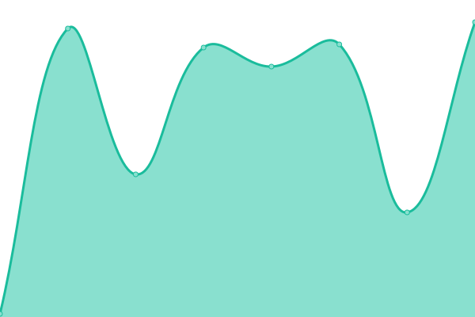
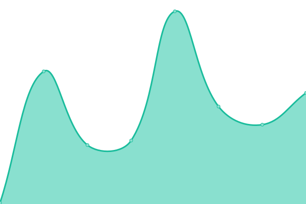
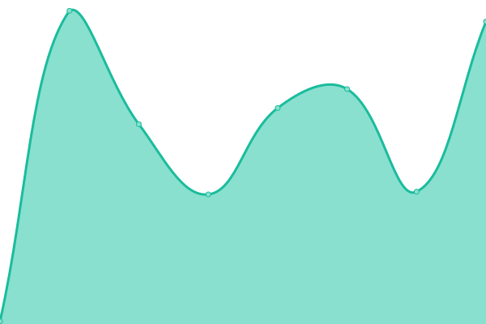

# [📈 Live Status](https://gaon12.github.io/gaonwiki_uptime): <!--live status--> **🟥 Complete outage**

This repository contains the open-source uptime monitor and status page for [gaon12](https://gaon12.github.io/gaonwiki_uptime), powered by [Upptime](https://github.com/upptime/upptime).

With [Upptime](https://upptime.js.org), you can get your own unlimited and free uptime monitor and status page, powered entirely by a GitHub repository. We use [Issues](https://github.com/gaon12/gaonwiki_uptime/issues) as incident reports, [Actions](https://github.com/gaon12/gaonwiki_uptime/actions) as uptime monitors, and [Pages](https://gaon12.github.io/gaonwiki_uptime) for the status page.

<!--start: status pages-->
<!-- This summary is generated by Upptime (https://github.com/upptime/upptime) -->
<!-- Do not edit this manually, your changes will be overwritten -->
<!-- prettier-ignore -->
| URL | Status | History | Response Time | Uptime |
| --- | ------ | ------- | ------------- | ------ |
|  [GaonWiki](https://www.gaonwiki.com/w/) | 🟥 Down | [gaon-wiki.yml](https://github.com/gaon12/gaonwiki_uptime/commits/HEAD/history/gaon-wiki.yml) | 

 69ms
     
 | 

<a href="https://gaon12.github.io/gaonwiki_uptime/history/gaon-wiki">0.00%</a>
    

|  [GaonWiki Beta](https://beta.gaonwiki.com/w/) | 🟥 Down | [gaon-wiki-beta.yml](https://github.com/gaon12/gaonwiki_uptime/commits/HEAD/history/gaon-wiki-beta.yml) | 

 76ms
     
 | 

<a href="https://gaon12.github.io/gaonwiki_uptime/history/gaon-wiki-beta">0.00%</a>
    

|  [GaonWiki Community](https://bbs.gaonwiki.com) | 🟥 Down | [gaon-wiki-community.yml](https://github.com/gaon12/gaonwiki_uptime/commits/HEAD/history/gaon-wiki-community.yml) | 

 70ms
     
 | 

<a href="https://gaon12.github.io/gaonwiki_uptime/history/gaon-wiki-community">0.00%</a>
    

<!--end: status pages-->

[**Visit our status website →**](https://gaon12.github.io/gaonwiki_uptime)

## 📄 License

- Powered by: [Upptime](https://github.com/upptime/upptime)
- Code: [MIT](./LICENSE) © [gaon12](https://gaon12.github.io/gaonwiki_uptime)
- Data in the `./history` directory: [Open Database License](https://opendatacommons.org/licenses/odbl/1-0/)
